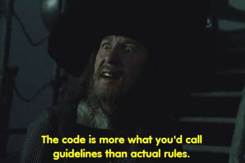

# Contributing

Rules can be summed up as the Bill and Ted Rule: Be Excellent to Each Other.

The rest of this is a bit tongue-in-cheek, 

However, they are things that generally get flagged during code review and can be improved.

### Why Kotlin?

Why not? 

### Other JVM Languages?

This app isn't going to be complex enough to even think of multiple languages.

Originally this was going to be Scala, and as much as I love Scala,
who wants to deal with sbt and all that fun?

If you're a Java native and can't figure out the Kotlin way to handle something,
write it in Java first and have it work. Then focus on transmogrifying it to Kotlin.
IntelliJ will do a lot of this magic for you.

If it's Java code that's so great that Torvalds would be proud to
review it and accept into the linux kernel? Then who am I to judge?

## Code Style and Testing

Be mindful of the code and tests you write. 

### Co-Pilot / AI / StackOverflow / Citing in general

Author has never used Co-Pilot or Chat Gippity to generate code.

Not saying "Don't". But would rather avoid any
potential copyright from some code generated from a
non-FOSS source. I can understand Boilerplate. 

Comment with `// autogenerated code`,
or put it in the Commit Message. No judgment if it's useful.

If you do use code from Stackoverflow, follow their ToS and
cite the answer (share link) if not the question URL.

That goes for any article if it requests to be cited.

More developers should do this because we all
know we all just copy and paste code 24/7.

This also helps if it needs to be altered / fix afterward. The original source could be helpful.

### Style

Be mindful of your code. Keep it simple, stupid.

Few key points, one for the front-end, one for the server-end.

* [JS-Joda](https://js-joda.github.io/js-joda/) for datetime manipulation. Do not introduce moment, luzon or any other JS DateTime library.
  * Yes, I know MUI requires DayJS. That's where it stops.
  * JS-Joda is identical to Java 8+'s `java.time` implementation.
    * Written by the same group behind JSR 310.
    * One of those rare moments when you can almost  
      copy and paste a class from one side to the other  
      and it would work
* Jackson for JSON Mapping. It's included with Spring Boot. 
  * It's the exec decision right now.
* Be mindful of any further libraries and / or dependencies that are included.
  * Be sure that it has a justifiable reason for inclusion.

The rest

* Avoid nested blocks of code.
* `return`, `throw` to end the method early instead of using ELSE for one line or a log message.
* Same with loops: know when to use `continue` to avoid IF / ELSE blocks inside a loop or refactor.
* Lambdas are preferred ways to transmogrify Maps, Lists, Objects
* *IFs inside IFs inside ELSE IFs?* Probably time to refactor.
* Try not to return a `NULL` purposely. Return an empty `Map`, `List`, `Set`, etc.
* If there is `if (null != list && !list.isEmpty())`, something else probably needs to addressed.

There could be an infinite number of things to add here.
But even just the basics above can help with readability,
bugs, and testing.

### Testing

There should be testing. But not to ludicrous lengths.

* Write good tests, not dumb tests just for code coverage.
* If you find you are writing multiple tests that test the functionality of a library you are using? Sigh.
  * Trust me. JS-Joda is well tested!
* Mock Data are good for manipulation. Mock Connections are not.
* The code you test should be simple to test.
  * If you are testing big methods and that big method has 4 branches to get coverage?
  * That big method should be refactored.
* If fixing a bug becomes difficult to pass the tests due to mocks,  
  the originating method is probably too complex to be tested and  
  the wrong things are being focused on.
  * Wait, why were there Mocks to begin with?
* Don't feel obligated to test API Endpoints.
  * It's Americans watching Cricket. The tests take three days to write and the Americans cheer at all the wrong times.
* If you are testing CRUD operations. [Everything you are doing is bad. I want you to know this.](https://www.youtube.com/watch?v=Lbyw0MVbniE)

**You should be testing methods that manipulate, conjure,
add, subtract, multiply, divide data.**
